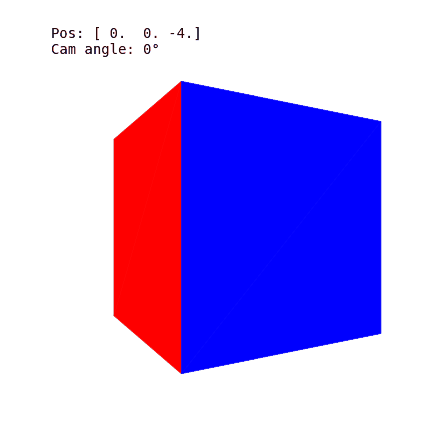
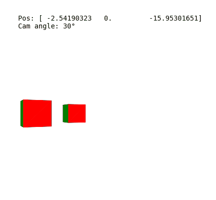

# 3D Engine from Scratch

**A software-based 3D rendering engine built from scratch to understand computer graphics.**

## About This Project
The primary goal of this project is educational. It is an attempt to build a functional 3D graphics engine from first principles, **without** relying on hardware acceleration (OpenGL/Vulkan) or high-level 3D libraries (Unity/Three.js/GLM).

By implementing the graphics pipeline manually—from matrix math to rasterization—I aim, with this project, to understand how a computer turns a list of raw numbers into a 3D world.

The engine is written in **modern C++** to ensure performance and real-time rendering capabilities (60+ FPS), using **SFML** strictly for window management and putting pixels on the screen.

  
  

## Key Features
* **Custom Mathematics:** Implementation of a custom Linear Algebra library (Vectors, Matrix 3x3, Rotation matrices).
* **Rendering Pipeline:** Manual implementation of the core graphics pipeline, from vertex transformations and back-face culling to near-plane clipping and rasterization.
* **Camera System:** Fully traversable 6-DOF camera system.
* **Architecture:** Modular C++ structure separating State, Scene, Renderer, and Input logic.

## Tech Stack
* **Language:** C++17
* **Build System:** CMake
* **Windowing & Input:** [SFML 3.0](https://www.sfml-dev.org/)
    * *Note: SFML is NOT used for 3D functions. It is used only as a canvas to draw 2D shapes calculated by the engine.*

## Controls
The engine supports multiple keyboard layouts. 
**[See CONTROLS.md for the full list of inputs.](readmes/CONTROLS.md)**

## How to run
Every information and instructions to run the project are documented.
**[See HOWTORUN.md for full details.](readmes/HOWTORUN.md)**

---
*Created for educational purposes.*

**[⬆ Back to Top](#)**